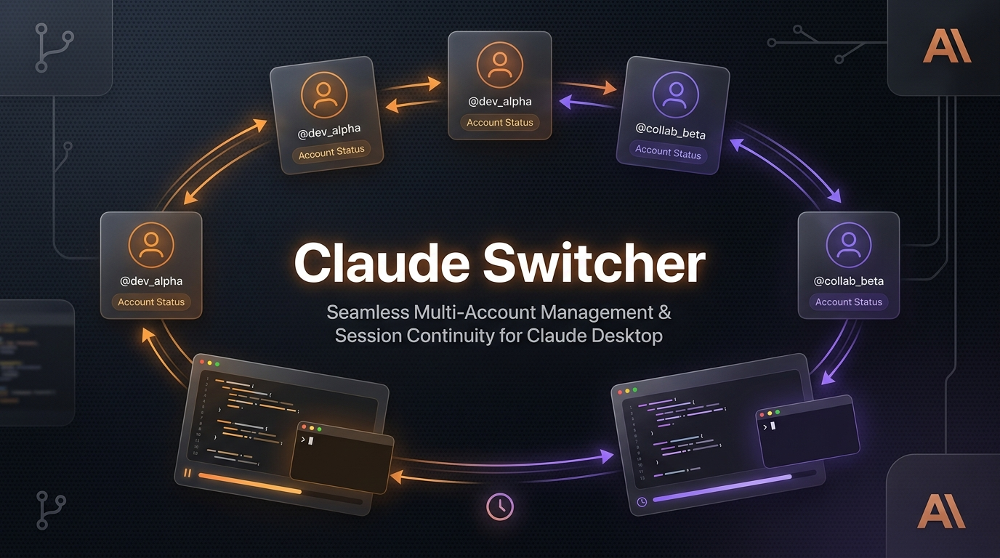

<div align="center">

# Claude Multi-Account Switcher ✦
### Instant Profile Swapping, Rate-Limit Session Continuity & Zero-Bloat Management for Claude Desktop on Windows 11

<p align="center">
  
</p>

[](https://github.com/Crypto90/ClaudeMultiAccountSwitcher)
[](https://www.python.org/)
[](https://riverbankcomputing.com/software/pyqt/)
[-orange?style=for-the-badge)](https://github.com/Crypto90/ClaudeMultiAccountSwitcher)
[](https://github.com/Crypto90/ClaudeMultiAccountSwitcher)
[](LICENSE)

<br/>

**Claude Multi-Account Switcher** is a high-performance, open-source Windows 11 desktop utility designed for developers and power users who work across multiple Claude Desktop accounts. Switch between accounts in under **1 second** without losing sign-ins, re-authenticating, or wasting disk space.

</div>

---

## ⚡ The Problem & The Solution

| The Challenge | How Claude Switcher Solves It |
| :--- | :--- |
| **Quota Limits & Interruptions**<br/>Hitting Claude's hourly rate limits stops your development momentum. | **Rate Limit Session Continuity**: Selectively move or copy active, in-progress sessions to a secondary account and continue working seamlessly without losing context. |
| **Repeated Logins & Lost Sessions**<br/>Logging out and back in forces 2FA, wipes local session tabs, and risks losing active state. | **1-Click Switching**: Each account profile maintains isolated, intact credentials and cookies. Switch in under 1 second. |
| **Gigabyte Disk Bloat**<br/>Claude Desktop's Coworker VM image (`vm_bundles`) and binary dependencies consume over **12 GB per profile**. | **Zero-Bloat Architecture**: Leaves the 12 GB Coworker VM and executables shared in place. Each profile consumes only **~10–15 MB** of auth metadata. |
| **Missing Sessions in Sidebar**<br/>Claude Desktop only indexes session files at boot and does not watch disk folders at runtime. | **Verified Auto-Relaunch**: Switches gracefully release database locks, copy credentials, and relaunch Claude Desktop via native Windows ShellExecute in **~200 ms**, ensuring sessions immediately load in the sidebar. |

---

## 🌟 Key Features

### 🛡️ 1. Zero Login Loss & Immutable Baseline Backup
- **Automatic First-Run Snapshot**: On first launch, the switcher detects your active signed-in Claude session and creates an immutable baseline backup in `%APPDATA%\ClaudeSwitcher\backups\initial_session\`.
- **Anti-Overwrite Protection**: The switcher strictly refuses to overwrite an authenticated profile with an unauthenticated or logged-out session state.
- **Panic Restore Button**: Restore your original baseline login at any time with a single click.

### 🔀 2. Selective Session Migration & Rate-Limit Continuity
- **Session Hub**: Inspect all Claude Cowork, Agent Mode, and Claude Code sessions across all accounts in a structured dashboard.
- **Move vs. Copy Support (Move by Default)**:
  - 🔘 **Move Mode (Default)**: Safely relocates the session to the target account and cleans up empty source directories to prevent duplicate clutter.
  - ⚪ **Copy Mode**: Duplicates the session to the target account while leaving the original intact.
- **Multi-Session Carryover on Switch**: When switching accounts, pick one, several, or all recent in-progress sessions to migrate on the fly.

### 🚀 3. Verified Native Relaunch (<250ms)
- Uses native Windows ShellExecute (`os.startfile`) targeting Windows Store/MSIX package identity (`shell:AppsFolder\Claude_pzs8sxrjxfjjc!Claude`).
- An active verification loop confirms that Claude Desktop processes are alive and running before signaling completion.
- Multi-tier fallback to `explorer.exe` shell URI and direct binary execution.

### 🗑️ 4. Full Session Lifecycle Management
- **Account Badges with Color Indicators**: Every session in the table shows which account owns it (`● Main Account`, `● Nico Pro`).
- **Single & Batch Deletion**: Delete individual sessions or batch-delete rate-limited duplicates with confirmation safeguards.
- **Directory Traversal Protection**: Deletion methods strictly verify that targeted files reside within `claude-code-sessions` and match valid session naming conventions.
- **Explorer Integration**: Right-click any session row to immediately open and highlight its JSON file in Windows File Explorer.

### 🎨 5. Windows 11 Fluent Dark UI & System Tray
- **Silky 60+ FPS**: Built with PyQt6 using hardware-accelerated font rendering and background worker threads (`QThread`). Process querying executes in **~14 ms** without ever freezing the UI.
- **Taskbar System Tray**: Switch accounts directly from the Windows taskbar tray icon next to the system clock.
- **Profile Customization**: Customize profile display names and pick from vibrant accent colors (Anthropic Terracotta, Violet, Emerald, Cyan, Rose, Blue, Amber, Slate) with live interactive preview.
- **Shared MCP Configurations**: Optionally synchronize your custom MCP server configurations (`claude_desktop_config.json`) across all accounts automatically.

---

## 📁 Repository Structure

```
ClaudeMultiAccountSwitcher/
├── assets/
│   └── hero_banner.jpg        # High-resolution README hero banner
├── core/
│   ├── config.py              # Path resolution, settings, exclusion sets
│   ├── detector.py            # High-speed process detection & lock monitoring
│   ├── process_manager.py     # WM_CLOSE graceful shutdown & verified launch
│   ├── profile_manager.py     # Zero-bloat profile swapping & baseline safety
│   └── session_manager.py     # Selective session transfer, move/copy & deletion
├── ui/
│   ├── styles.py              # Windows 11 Fluent Dark QSS theme
│   ├── account_card.py        # Interactive account cards with status pills
│   ├── session_hub.py         # Session management table with search & actions
│   ├── add_dialog.py          # Account creation wizard
│   ├── edit_dialog.py         # Account customization dialog
│   ├── backup_dialog.py       # Backup management and baseline restore
│   ├── tray_icon.py           # Windows taskbar system tray integration
│   ├── worker.py              # Background QThread workers (non-blocking UI)
│   └── main_window.py         # Master dashboard container
├── tests/
│   ├── test_core.py           # Unit tests for core logic, move/copy, and launch
│   └── test_ui.py             # Headless offscreen UI component validation
├── create_shortcut.py         # Windows desktop shortcut generator
├── main.py                    # Application entry point (GUI and CLI modes)
├── requirements.txt           # Python dependency specifications
└── run.bat                    # 1-click Windows launcher
```

---

## 🚀 Quick Start

### Prerequisites
- **Operating System**: Windows 10 / Windows 11 (64-bit)
- **Python**: 3.10 or higher
- **Claude Desktop**: Installed via official Anthropic Windows installer or Windows Store (MSIX)

### Installation

1. **Clone the repository**:
   ```bash
   git clone https://github.com/Crypto90/ClaudeMultiAccountSwitcher.git
   cd ClaudeMultiAccountSwitcher
   ```

2. **Install dependencies**:
   ```bash
   pip install -r requirements.txt
   ```

3. **Launch the Application**:
   Double-click `run.bat`, or run from terminal:
   ```bash
   python main.py
   ```

4. *(Optional)* **Create a Desktop Shortcut**:
   ```bash
   python create_shortcut.py
   ```

---

## 📖 How to Use

### Adding a New Account
1. Open the **Accounts** tab and click **+ Add Account**.
2. Enter a display name (e.g. `Work Pro` or `Client Account`) and select an accent color.
3. Choose whether to share your MCP tool configurations.
4. Click **Start Setup & Open Claude**.
5. Claude Desktop will open in a clean sign-in window. Log in with your new account.
6. Claude Switcher automatically detects the new login credentials and saves the profile!

### Switching Accounts with Session Migration
1. Click **Switch To This Account** on any account card, or right-click the **System Tray icon**.
2. If the current account has active sessions, a dialog will appear:
   - Select the sessions you want to continue working on.
   - Choose **Move sessions (recommended)** to relocate them, or **Copy sessions** to duplicate them.
   - Click **Switch & Move (N)**.
3. Claude Desktop is closed safely, the profile is swapped, sessions are relocated, and Claude Desktop restarts logged into your new account with your sessions ready in the left sidebar!

### Managing Sessions in the Session Hub
1. Open the **Session Hub (Rate Limits)** tab.
2. View sessions sorted by last activity, project path, turns, and owning account.
3. **Filter**: Use the search bar to filter by title or project directory.
4. **Transfer**: Click **Transfer →** on any row or select multiple checkboxes and click **Transfer Selected**.
5. **Delete**: Click **[Delete]** to remove duplicate or finished sessions, or use **Delete Selected (N)** for batch cleanup.
6. **File Explorer**: Right-click any row and select **Show in File Explorer** to inspect the session file.

---

## ⚙️ CLI Commands

Claude Switcher can also be controlled directly from PowerShell or Command Prompt:

```bash
# List all registered accounts and active status
python main.py --list

# Switch directly to an account by ID
python main.py --switch account_primary

# Launch directly minimized to the Windows system tray
python main.py --tray
```

---

## 🧪 Running Automated Tests

Run the complete unit test suite across core engines and offscreen UI components:

```bash
python -m pytest tests/ -v
```

All 15 test suites validate path resolution, zero-bloat exclusions, security checks, verified process restarts, and selective session migration:
```
tests/test_core.py::TestCoreModules::test_config_paths_and_defaults PASSED
tests/test_core.py::TestCoreModules::test_delete_session PASSED
tests/test_core.py::TestCoreModules::test_delete_session_security_check PASSED
tests/test_core.py::TestCoreModules::test_delete_sessions_batch PASSED
tests/test_core.py::TestCoreModules::test_launch_claude_verified PASSED
tests/test_core.py::TestCoreModules::test_selective_session_move PASSED
tests/test_core.py::TestCoreModules::test_selective_session_transfer PASSED
tests/test_core.py::TestCoreModules::test_session_payload_copy_excludes_heavy_items PASSED
tests/test_core.py::TestCoreModules::test_switch_account_restarts_claude_with_status_callback PASSED
tests/test_ui.py::TestUI::test_account_card_creation PASSED
tests/test_ui.py::TestUI::test_add_dialog_creation PASSED
tests/test_ui.py::TestUI::test_edit_dialog_creation PASSED
tests/test_ui.py::TestUI::test_session_hub_widget_creation PASSED
tests/test_ui.py::TestUI::test_switch_prompt_dialog_multi_select PASSED
tests/test_ui.py::TestUI::test_worker_instantiation PASSED
============================= 15 passed in 0.18s ==============================
```

---

## 🔒 Security & Privacy

- **100% Local & Offline**: All profile switching, credentials, and session management occur entirely on your local machine. No external servers or telemetry are used.
- **Session Sandboxing**: Session deletion methods enforce strict directory traversal checks, ensuring only valid session JSON files inside `claude-code-sessions` can ever be modified.
- **Protected Baseline**: The `initial_session` backup is isolated and never overwritten by normal profile operations.

---

## 📄 License

This project is licensed under the [MIT License](LICENSE) — free for personal and commercial use.

---

<div align="center">
  <sub>Built with ❤️ for the Claude developer community.</sub>
</div>
